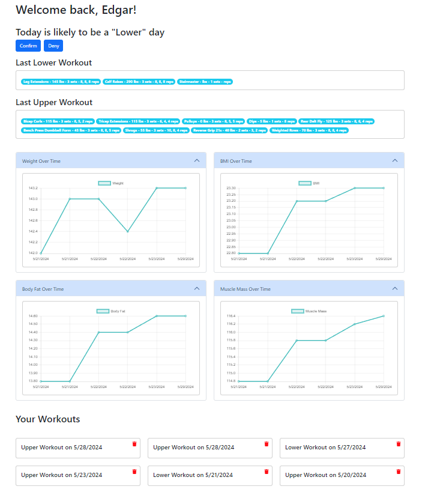
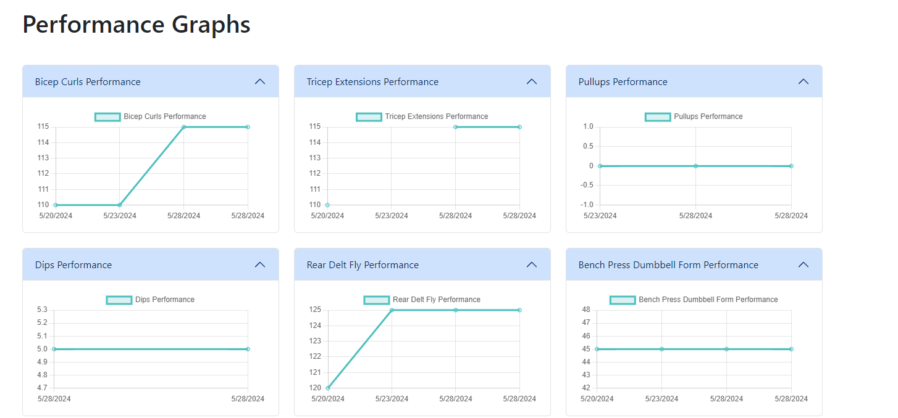
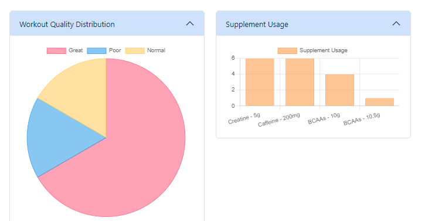

# Workout Logger App

Welcome to the Workout Logger App! This app allows you to log and analyze your workouts dynamically. It supports multiple users and features a variety of smart functionalities to enhance your workout logging experience.

## Features

- **User Authentication**: Securely log in and manage your workouts.
- **Dynamic Workout Logging**: Log different types of workouts including weight training and cardio.
- **Custom Exercises**: Add your own exercises and the app will remember them for future sessions.
- **Split Day Specific Exercises**: Exercises are remembered and suggested based on the workout split day.
- **Supplement Tracking**: Track your supplement intake along with your workouts.
- **Nutrition Logging**: Log what you ate during your workout.
- **Workout Quality Tracking**: Rate the quality of your workout.
- **Workout History**: View your past workouts in a clean, card-based interface.
- **Weight, BMI, Body Fat, and Muscle Mass Tracking**: Track your weight, BMI, body fat, and muscle mass over time with visual charts on the homepage.
- **Performance Graphs**: Visualize your performance for individual exercises with detailed line charts.
- **Workout Quality and Supplement Usage Analysis**: View pie and bar charts for workout quality distribution and supplement usage.

## How It Works

### Logging a Workout

1. **Select Workout Split Day**: Choose the day split from options such as Upper, Lower, Push, Pull, Legs, Cardio, etc.
2. **Add Exercises**:
   - For weight training, input the exercise name, weight, sets, and reps.
   - For cardio, input the exercise name, duration, and/or distance.
3. **Add Supplements**: Track supplements consumed before, during, or after your workout.
4. **Log Nutrition**: Input details about what you ate around your workout.
5. **Rate Workout Quality**: Rate the workout as Poor, Normal, or Great.
6. **Submit Workout**: Save your workout data, and it will be remembered for future sessions.

### Smart Remembering Features

- **Custom Exercises by Split Day**: The app remembers exercises you add and suggests them based on the selected split day. For example, if you add "Chest Flys" during an Upper split, it will suggest "Chest Flys" the next time you log an Upper split workout.
- **Supplement Tracking**: Custom supplements are remembered and suggested in future sessions.

### Viewing Past Workouts

- **Dashboard**: View your workout history in a card-based layout, with each card displaying the date of the workout.

- **Detailed View**: Click on a workout card to see detailed information about the exercises performed, supplements taken, nutrition logged, and workout quality.

### Deleting Workouts

- **Delete Option**: Each workout card includes a trash icon. Click the icon to delete the workout after confirming your choice in a dialog.

### Tracking Metrics Over Time

- **Weight, BMI, Body Fat, and Muscle Mass Charts**: View visual charts that display your weight, BMI, body fat, and muscle mass metrics over time on the homepage. This feature helps you track your progress and stay motivated.

### Performance Graphs

- **Exercise Performance Graphs**: Visualize your performance for individual exercises with detailed line charts.

### Workout Quality and Supplement Usage Analysis

- **Workout Quality Distribution**: View a pie chart showing the distribution of workout quality ratings.
- **Supplement Usage**: View a bar chart showing the frequency of supplement usage.

## Future Enhancements

- **Workout Recommendations**: Get personalized workout recommendations based on your past logs and progress.
- **Progress Tracking**: Advanced analytics to track your performance and improvements over time.
- **Community Features**: Connect with other users, share workouts, and get inspired.
- **Mobile App**: A dedicated mobile app for even easier workout logging on the go.

## Getting Started

### Prerequisites

- Node.js
- npm or yarn

### Installation

1. Clone the repository:

\`\`\`sh
git clone https://github.com/your-username/workout-logger.git
cd workout-logger
\`\`\`

2. Install dependencies:

\`\`\`sh
npm install
# or
yarn install
\`\`\`

3. Set up Firebase:

   - Create a Firebase project in the [Firebase Console](https://console.firebase.google.com/).
   - Set up Firestore and Authentication.
   - Add your Firebase configuration to \`src/firebase.js\`.

4. Start the app:

\`\`\`sh
npm start
# or
yarn start
\`\`\`

### Usage

1. Sign up or log in to your account.
2. Start logging your workouts.
3. View and manage your past workouts from the dashboard.

## Contributing

Contributions are welcome! Please open an issue or submit a pull request for any improvements or bug fixes.

## License

This project is licensed under the MIT License.

---

Thank you for using the Workout Logger App! Stay tuned for exciting new features and improvements. Happy logging!
